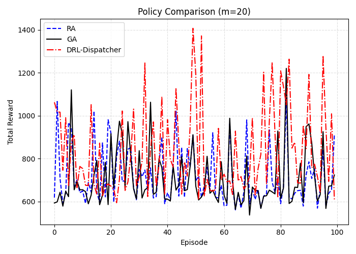
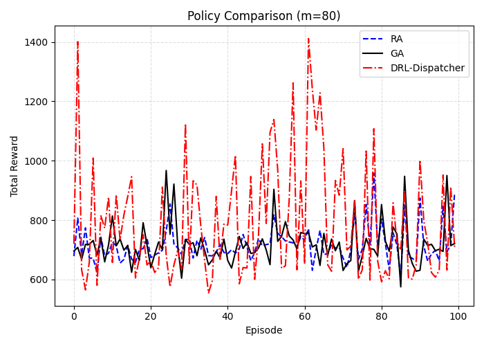
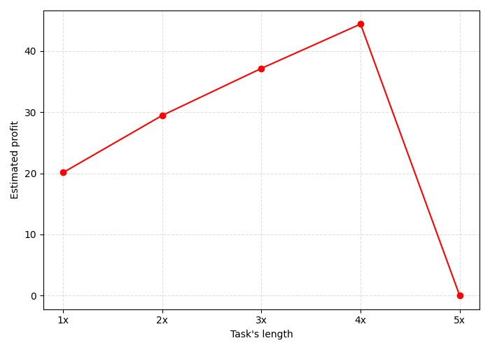
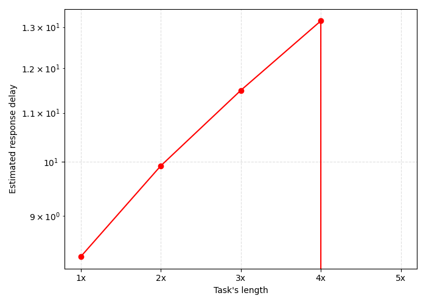

# Edge-AI: Python-Based IoT Request Provisioning

This repository contains a **Python implementation** of the research paper **"Edge-AI: IoT Request Service Provisioning in Federated Edge Computing Using Actor-Critic Reinforcement Learning"**.

It implements a **Deep Reinforcement Learning (Actor-Critic)** agent to optimize task dispatching in a Federated Edge Computing (FEC) environment. The system balances **profit maximization** for edge service providers and **latency minimization** for IoT devices.

## Paper Reference
**Title:** Edge-AI: IoT Request Service Provisioning in Federated Edge Computing Using Actor-Critic Reinforcement Learning  
**Authors:** Hojjat Baghban, Amir Rezapour, Ching-Hsien Hsu, Sirapop Nuannimnoi, Ching-Yao Huang  
**Journal:** IEEE Transactions on Engineering Management 

## System Architecture

The project simulates a Multi-access Edge Computing (MEC) environment where an intelligent orchestrator (Edge-AI) decides where to process incoming IoT tasks:
1.  **Local Execution:** Process on the receiving edge node.
2.  **Offloading:** Dispatch to a different edge cluster in the federation.

### Key Components
* **Environment (`env.py`):** A custom environment simulating edge nodes, varying network costs, and task generation (Poisson/Gaussian distributions).
* **Agent (`models.py`):** An Actor-Critic neural network implemented in Python.
    * **Actor:** Outputs a probability distribution over edge clusters.
    * **Critic:** Estimates the value function to guide the actor updates.
* **Clustering (`clustering.py`):** Uses K-Means to group edge nodes by computational and communication costs to reduce the action space.

## Project Structure

```bash
├── env.py           # Custom Environment (State, Reward, Transition logic)
├── models.py        # Neural Network definitions (Actor & Critic)
├── training.py      # Main entry point: Training loop and Evaluation
├── baseline.py      # Random and Greedy algorithms for comparison
├── clustering.py    # K-Means clustering logic for edge nodes
├── atm.py           # Action Translator Module (Cluster -> Specific Node)
├── plots.py         # Visualization utilities
└── RESULT/          # Directory where plots are saved
```

## Installation & Usage 
Prerequisites
  Ensure you have Python 3.8+ installed.
  Install the required Python libraries
  ```bash
  pip install numpy torch gymnasium matplotlib scikit-learn tqdm
  ```
  
## Running the Simulation
To train the agent and generate the comparison plots
```bash
python training.py
```
This will:
* Initialize the Federated Edge Environment.
* Train the Actor-Critic agent for m=20 and m=80 node topologies.
* Run baseline benchmarks (Random Policy, Greedy Policy).
* Generate performance metrics in the RESULT/ directory.

## Results
### 1. Convergence
The intelligent agent learns to maximize the total reward (weighted sum of Profit and Latency) over 300+ episodes.

.png)
> *Performance of the learning agent on various federation sizes. The solid lines represent smoothed total rewards with a window size of 40 episodes. (a) Federation size m = 20. (b) Federation size m = 80.*

### 2. Policy Comparison
Comparison of the **DRL-Dispatcher** against **Greedy** (lowest utilization) and **Random** policies. The Python-based agent consistently achieves higher cumulative rewards by learning the trade-off between communication costs and processing speed.

<table>
  <tr>
    <td align="center"></td>
    <td align="center"></td>
  </tr>
  <tr>
    <td align="center"><b>Federation Size = 20</b></td>
    <td align="center"><b>Federation Size = 80</b></td>
  </tr>
</table>

> *Comparison of the performance of DRL-Dispatcher, GA, and RA in terms of cumulative reward on different federation sizes.*

### 3. Impact of Task Features
The system was stress-tested against increasing task lengths (CPU cycles) and task sizes (Data size).

* **Profitability:** As task length increases, the agent successfully identifies profitable offloading opportunities, maintaining a positive profit margin (Revenue > Cost).
* **Latency:** The agent minimizes delay even as task sizes grow by intelligently routing data to nodes with higher bandwidth.

<table>
  <tr>
    <td align="center"></td>
    <td align="center"></td>
  </tr>
  <tr>
    <td align="center"><b>(a) Profit vs. Task Length</b></td>
    <td align="center"><b>(b) Delay vs. Task Length</b></td>
  </tr>
</table>

> *Effect of input task's length on estimated profit and estimated response delay for m=20. The estimated response delays are on a logarithmic scale.*


License: This project is an open-source Python implementation for educational and research purposes.
